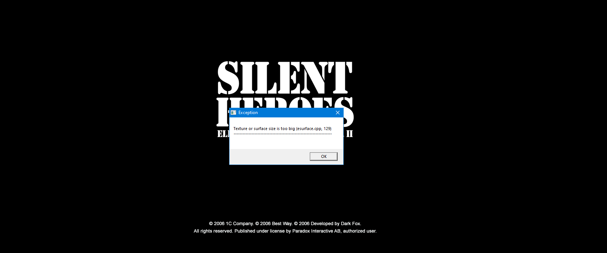

# Silent Heroes widescreen fix
Widescreen and Resolution fix for Silent Heroes: Elite Troops of World War II.

**It also fixes `Texture or surface size is too big (esurface.cpp, 129)` error!**

## Installation

- Download zip from [releases](https://github.com/zocker-160/Silent-Heroes-widescreen-fix/releases) and unpack the files inside next to the `Silent Heroes.exe`

## Supported Versions

- version `1.29A.6` `Silent Heroes.exe` SHA256 `8008cea52356f7e815b130d0b2a6c4165c6e78e07312717919cbe1d40f7262f9`
    
## Known Limitations

- videos might only play sound - no idea why :(

## Showcase
### Main Menu

### Original Zoom

### Patched Zoom

